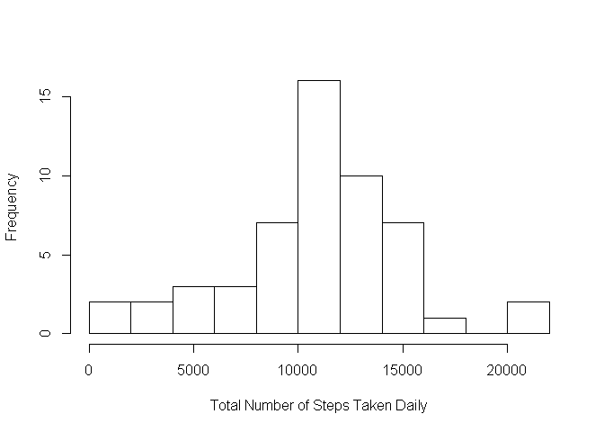
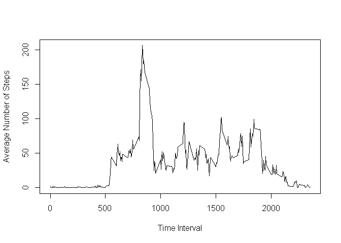
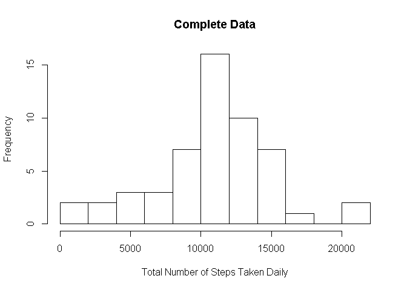
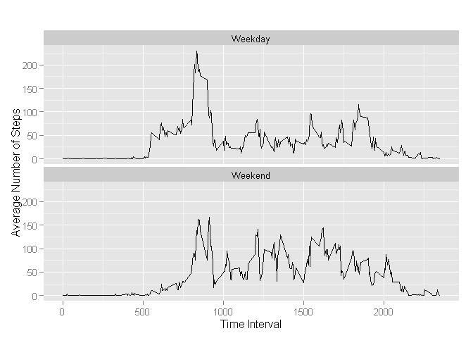

# Reproducible Research: Peer Assessment 1
YZ  
9 August 2015  


## Loading and preprocessing the data
Load input data from a zip file from the 'RepData_PeerAssessment1' folder under current R working directory.

```r
#load data
df<-read.csv('~/RepData_PeerAssessment1/activity.csv')
```
The first few rows of the raw dataset is as:

```r
head(df)
```

```
##   steps       date interval
## 1    NA 2012-10-01        0
## 2    NA 2012-10-01        5
## 3    NA 2012-10-01       10
## 4    NA 2012-10-01       15
## 5    NA 2012-10-01       20
## 6    NA 2012-10-01       25
```


## What is mean total number of steps taken per day?

Aggreate the number of steps by day and plot the distribution histogram.


```r
# aggregate data by day
agg<-data.frame(tapply(df$steps, df$date, sum))
colnames(agg) <- 'numofSteps'
hist(agg$numofSteps,main='',
     breaks=10,
     xlab='Total Number of Steps Taken Daily')#hist
```

 

The average number of steps per day is:

```r
mean(agg$numofSteps, na.rm = TRUE) 
```

```
## [1] 10766.19
```
The median number of steps per day is:

```r
median(agg$numofSteps, na.rm = TRUE) 
```

```
## [1] 10765
```

## What is the average daily activity pattern?

Average the number of steps by time interval and plot the results in a line chart.


```r
# plot average steps per time interval
ave<-data.frame(tapply(df$steps, df$interval, FUN=function(x) mean(x,na.rm = TRUE)))#calculate average steps
colnames(ave) <- 'aveStep' # change col name
ave$rownumber <- rownames(ave)
plot(x = as.numeric(ave$rownumber),y = ave$aveStep,type = 'l',xlab = 'Time Interval', ylab = 'Average Number of Steps')#line plot
```

 

## Imputing missing values

- The first setp is to check which columns have missing values
The number of missing values ('NA') for all 3 columns are:
number of rows with NA in column 'steps'

```r
nrow(df[df$steps == 'NA',])
```

```
## [1] 2304
```
number of rows with NA in column 'date'

```r
nrow(df[df$date == 'NA',])
```

```
## [1] 0
```
number of rows with NA in column 'interval'

```r
nrow(df[df$interval == 'NA',])
```

```
## [1] 0
```
It is noticed that only the 'steps' column has missing values

- The second step is to fill the missing values
The average value for the corresponding time interval is used to replace these missing values as following. The first section of the completed data is shown here:


```r
# fill missing steps using average steps by time intervals
df.null <- subset(df, is.na(df$steps))
df.fillnull <- merge(df.null, ave, by.x = 'interval', by.y = 'rownumber')
df.fillnull$steps <- df.fillnull$aveStep
df.fillnull$aveStep <- NULL
df.complete <- rbind(df.fillnull, subset(df, !is.na(df$steps)))
```
Then all the missing values are filled, the first few rows of the complete dataset is as follow:

```r
head(df.complete)
```

```
##   interval    steps       date
## 1        0 1.716981 2012-10-01
## 2        0 1.716981 2012-11-30
## 3        0 1.716981 2012-11-04
## 4        0 1.716981 2012-11-09
## 5        0 1.716981 2012-11-14
## 6        0 1.716981 2012-11-10
```

Make a histogram of the total number of steps taken each day.

```r
# aggregate data by day
agg<-data.frame(tapply(df$steps, df$date, sum))
colnames(agg) <- 'numofSteps'
hist(agg$numofSteps,main='Complete Data',
     breaks=10,
     xlab='Total Number of Steps Taken Daily')#hist
```

 

The average number of steps per day is:

```r
mean(agg$numofSteps, na.rm = TRUE) 
```

```
## [1] 10766.19
```
The median number of steps per day is:

```r
median(agg$numofSteps, na.rm = TRUE) 
```

```
## [1] 10765
```

## Are there differences in activity patterns between weekdays and weekends?

The data is broken down be weekday and weekends and plotted as follow:

```r
#weekday and weekend arrays
weekday <- c('Monday','Tuesday','Wednesday','Thursday','Friday')
weekend <- c('Saturday','Sunday')
df.complete$dayofweek <- 'NA'
df.complete[weekdays(as.POSIXct(df.complete[,3]))%in%weekday,4]<-'Weekday'
df.complete[weekdays(as.POSIXct(df.complete[,3]))%in%weekend,4]<-'Weekend'
df.complete.ave<-data.frame(tapply(X = df.complete$steps, INDEX = list(df.complete$interval, df.complete$dayofweek) , 
                                   FUN=function(x) mean(x,na.rm = TRUE)))#calculate average steps
df.complete.ave$rownumber <- rownames(df.complete.ave)
require(reshape)
```

```
## Loading required package: reshape
```

```
## Warning: package 'reshape' was built under R version 3.2.2
```

```r
temp <- melt(df.complete.ave,id.vars = 'rownumber')
temp$variable <- as.factor(temp$variable)
require(ggplot2)
```

```
## Loading required package: ggplot2
```

```r
ggplot(temp, aes(as.numeric(rownumber), value)) +
    geom_line(aes(group = variable)) +
    ggtitle("") + 
    facet_wrap(~variable, ncol = 1) +
    xlab('Time Interval') +
    ylab('Average Number of Steps')
```

 

Therefore the number of steps taken on weekdays and weekends are significantly different as the chart shows.
